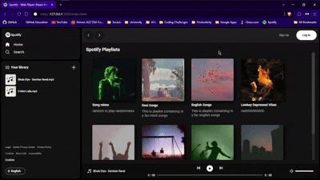

# 🎵 Spotify-Themed Music Player

A fully responsive and interactive music player designed with a Spotify-inspired UI.

## 🎯 Primary Goal

The primary goal of this project was to enhance my JavaScript knowledge by working on a real, interactive project. Through this, I aimed to strengthen my understanding of event handling, the `Audio` object, DOM manipulation, and responsive UI design.

## 🌟 Learning Experience

Working on this project has been an amazing experience! Implementing play/pause functionality, volume control, and track navigation allowed me to explore the JavaScript `Audio` object and its properties in depth. I learned a lot of new concepts and gained hands-on experience in handling audio in web applications. 

This project has motivated me to dive deeper into Web APIs, and I plan to build even cooler projects in the future using them! 🚀

## 🚀 Features

- 🎶 Play, pause, and control music volume
- ⏭️ Next and Previous track functionality
- 📂 Dynamic album management (Just add a folder with a cover photo and `info.json` file containing title and description)
- 📱 Fully responsive design for all devices
- 🎨 Attractive UI with smooth animations

## 🛠️ Technologies Used

- HTML5, CSS3, JavaScript (Vanilla)
- No external APIs used

## Project Showcase

### Desktop Preview



### Mobile Preview


## 📌 Setup Instructions

1. **Clone the repository**
   ```sh
   git clone https://github.com/yourusername/spotify-music-player.git
   cd spotify-music-player
   ```

2. **Run the project using Live Server**
   Since this project loads local files dynamically, you need to use a live server to run it properly.
   - If you're using VS Code, install the [Live Preview extension](https://marketplace.visualstudio.com/items?itemName=ms-vscode.live-server).
   - Right-click `index.html` and select **Open with Live Preview**.
   - The project will open in your default browser.

## 📂 Project Structure

```
📦 Spotify-Themed Music Player
 ┣ 📂 albums (Contains song playlists, each as a separate folder with metadata)
 ┣ 📂 assets (Contains resource files used in the project)
 ┣ 📂 css 
   ┣ 📜 style.css
   ┣ 📜 utility.css
 ┣ 📂 js 
 ┃ ┣ 📜 script.js
 ┣ 📜 index.html
 ┣ 📜 README.md
```

## 📜 License

This project is licensed under the MIT License.